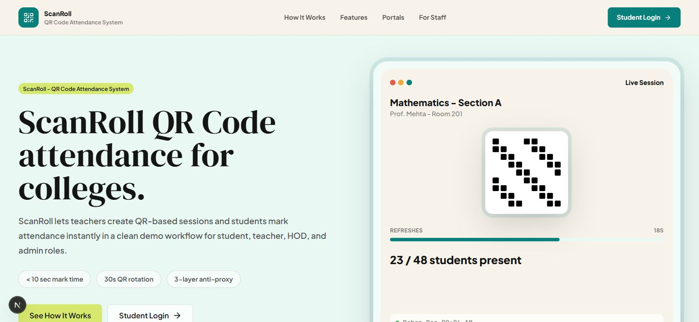
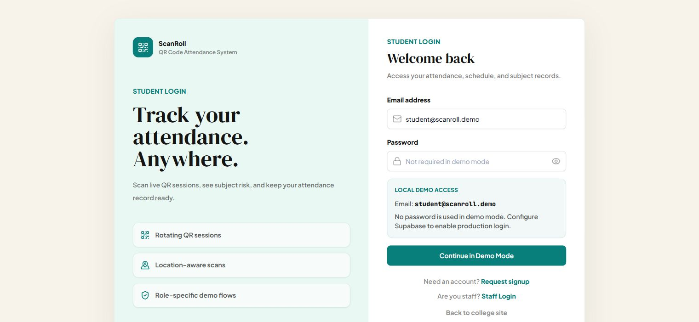
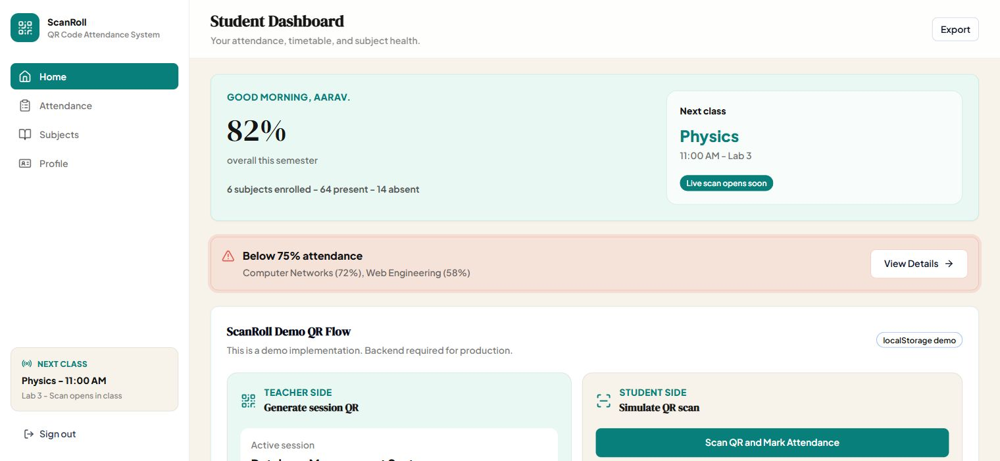
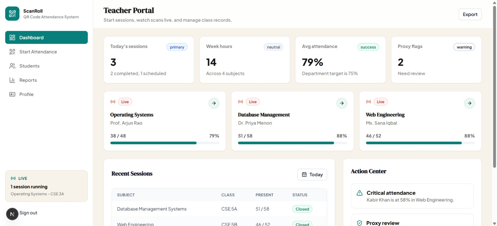
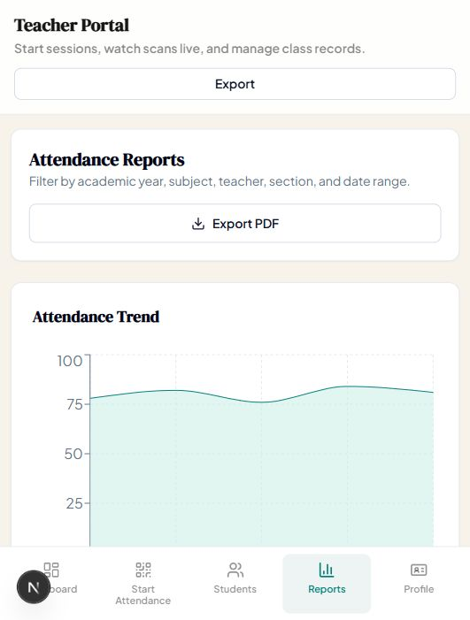
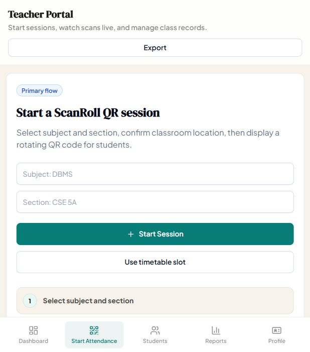

# ScanRoll

ScanRoll is an open-source QR Code Attendance System for colleges. Teachers can create QR-based attendance sessions, students can scan the QR from their phone, and admins/HODs can review attendance dashboards and reports.

The project is designed to be easy to try first, then connect to a real backend later.

## What You Can Do

- Run a working local demo without creating any backend account.
- Open student, teacher, HOD, and admin dashboards.
- Simulate QR attendance sessions.
- Scan a real QR code with the camera on supported devices.
- Export attendance reports as CSV or PDF.
- Connect Supabase for real authentication, database storage, and server-side QR validation.

## Who This README Is For

This guide is written for non-technical users too. If you can install an app and copy-paste commands, you can run the demo.

If you get stuck, check [SETUP.md](./SETUP.md). It has slower step-by-step instructions and troubleshooting.

## Setup Option 1: Quick Demo

Use this if you only want to see the website working on your laptop.

### Step 1: Install Node.js

Install Node.js from:

```text
https://nodejs.org
```

Choose the LTS version if you are unsure.

### Step 2: Open The Project Folder

Open a terminal in the project folder.

On Windows, you can open the folder, click the address bar, type `powershell`, and press Enter.

### Step 3: Install The App

```bash
npm install
```

### Step 4: Start The App

```bash
npm run dev
```

### Step 5: Open The Website

Open this address in your browser:

```text
http://127.0.0.1:3000
```

## Demo Login Emails

In demo mode, no password is required.

| Role | Login Page | Demo Email |
|---|---|---|
| Student | `/login` | `student@scanroll.demo` |
| Teacher | `/teacherlogin` | `teacher@scanroll.demo` |
| HOD | `/hodlogin` | `hod@scanroll.demo` |
| Admin | `/admin/login` | `admin@scanroll.demo` |

Demo data is stored in your browser only. It is safe for testing, but it is not for real college attendance.

## Setup Option 2: Supabase Backend

Use this when you want real login, database persistence, and server-side QR validation.

Short version:

1. Create a Supabase project.
2. Run the SQL migration files from `supabase/migrations` in order.
3. Copy `.env.example` to `.env.local`.
4. Paste your Supabase URL, anon key, and service role key into `.env.local`.
5. Create real Supabase Auth users and matching rows in the `users` table.
6. Run `npm run dev`.

Detailed instructions are in [SETUP.md](./SETUP.md).

## Features

- QR-based attendance marking
- Student, Teacher, HOD, and Admin portals
- Role-checked login when Supabase is configured
- Server-side QR token validation
- Attendance logs and summaries
- Camera QR scanner
- CSV and PDF report exports
- Supabase database migrations
- Demo mode for easy local testing

## Product Preview

### Landing Page



### Student Login



### Student Attendance Dashboard



### Teacher Dashboard



### Teacher Reports



### Teacher Start Attendance / Live QR



## How It Works

1. Teacher starts an attendance session.
2. ScanRoll creates a QR token.
3. Student scans the QR code.
4. The server checks the token, user role, expiry, and duplicate status.
5. Attendance is recorded.
6. Teacher/HOD/Admin can review reports.

## Tech Stack

- Next.js 15
- React
- Tailwind CSS
- Supabase Auth and PostgreSQL
- `qrcode` for QR display
- `html5-qrcode` for camera scanning
- Recharts

## Common Commands

```bash
npm install
npm run dev
npm run lint
npm run typecheck
npm run build
```

## Environment Variables

Create `.env.local` only when connecting Supabase.

```bash
copy .env.example .env.local
```

On macOS/Linux:

```bash
cp .env.example .env.local
```

See [.env.example](./.env.example) for the full list.

## Project Status

**Current Status: MVP/Development Starter Kit**

ScanRoll is in active development and currently suitable for:
- Local development and testing
- Demo purposes
- Understanding the architecture
- Contributing to open-source development

**Not suitable for:**
- Production use with real student data
- Mission-critical attendance systems
- Large-scale deployments

See [ROADMAP.md](./ROADMAP.md) for planned features and milestones.

## Known Limitations

- **Security**: Requires security hardening before production use
- **Scalability**: Not tested for large-scale deployments
- **Testing**: Limited test coverage (needs expansion)
- **Error Handling**: Basic error handling, needs improvement
- **Audit Logging**: Limited audit trail functionality
- **Rate Limiting**: Basic implementation, needs production-grade limits
- **Mobile Support**: Responsive design but not mobile-optimized
- **Offline Support**: No offline functionality

## Security Model Summary

ScanRoll uses a layered security approach:

- **Supabase Auth**: User authentication and session management
- **Row Level Security (RLS)**: Database-level access control
- **Role-based Access Control**: Student, Teacher, HOD, Admin roles
- **Server-side Validation**: API route validation and business logic
- **Service Role Key**: Bypasses RLS for privileged operations (server-only)

**Critical Security Requirements:**
- Never expose `SUPABASE_SERVICE_ROLE_KEY` to client code
- Complete all RLS policies before production
- Implement rate limiting on all API endpoints
- Review and harden all input validation
- Enable audit logging for sensitive operations

See [SECURITY.md](./SECURITY.md) for complete security documentation.

## Privacy and Student Data Warning

⚠️ **Student Data Privacy Notice**

This system handles sensitive student information including:
- Personal identifiers (name, email, mobile)
- Attendance records and patterns
- Academic enrollment information
- Location data (geofencing)

**Requirements for Production Use:**
- Compliance with applicable privacy laws (GDPR, FERPA, etc.)
- Institutional privacy policy review and approval
- Student consent mechanisms
- Data retention and deletion policies
- Secure backup and recovery procedures
- Audit trail for all data access

See [docs/PRIVACY.md](./docs/PRIVACY.md) for detailed privacy considerations.

## Testing

**Current Testing Status: Limited**

The project currently has:
- Basic manual testing procedures
- No automated test suite (planned)
- No integration tests (planned)
- No security tests (planned)

**Planned Testing Improvements:**
- Unit tests with Vitest
- API route integration tests
- Database/RLS policy tests
- Security validation tests
- End-to-end QR flow tests

See [CONTRIBUTING.md](./CONTRIBUTING.md) for testing guidelines.

## Folder Structure

```
ScanRoll/
├── src/
│   ├── app/                 # Next.js pages and API routes
│   │   ├── api/            # Backend API endpoints
│   │   ├── admin/          # Admin dashboard pages
│   │   ├── dashboard/      # Student dashboard
│   │   ├── teacher/        # Teacher dashboard
│   │   └── hod/            # HOD dashboard
│   ├── components/         # Reusable UI components
│   ├── lib/               # Utility functions and helpers
│   │   ├── supabase/      # Supabase client configurations
│   │   └── backend/       # Server-side logic
│   └── types.ts           # TypeScript type definitions
├── supabase/
│   ├── migrations/        # Database schema migrations
│   ├── functions/         # Database functions
│   └── seed.sql          # Sample data
├── docs/                 # Additional documentation
├── .github/              # GitHub workflows and templates
└── *.md                 # Project documentation
```

## Important Production Notice

Before using ScanRoll with real students, review:

- Supabase RLS policies
- Admin account creation process
- QR expiry settings
- Audit logs
- Rate limiting
- Backups
- College privacy requirements

Read [SECURITY.md](./SECURITY.md) before production use.

## Project Files To Know

| File/Folder | Purpose |
|---|---|
| `src/app` | Website pages and API routes |
| `src/components` | Reusable UI components |
| `src/lib` | Data, backend helpers, Supabase clients |
| `supabase/migrations` | Database schema files |
| `.env.example` | Environment variable template |
| `SETUP.md` | Detailed setup guide |
| `SECURITY.md` | Security notes |

## Contributing

Contributions are welcome. Please read [CONTRIBUTING.md](./CONTRIBUTING.md).

> **⚠️ PRODUCTION WARNING: MVP/STARTER-KIT STATUS**
> 
> ScanRoll is currently an MVP/starter-kit and **must not be used with real student data** until you have completed the security hardening steps in [SECURITY.md](./SECURITY.md) and [PRODUCTION_CHECKLIST.md](./PRODUCTION_CHECKLIST.md).
> 
> This is a demonstration project for development and testing purposes only. Using it with real student data without proper security configuration poses serious privacy and security risks.
> 
> **Required reading before any production use:**
> - [SECURITY.md](./SECURITY.md) - Security model and requirements
> - [SETUP.md](./SETUP.md) - Complete setup guide
> - [PRODUCTION_CHECKLIST.md](./PRODUCTION_CHECKLIST.md) - Production deployment checklist
> - [RELEASE_CHECKLIST.md](./RELEASE_CHECKLIST.md) - Release preparation checklist


## License

MIT License. See [LICENSE](./LICENSE).
